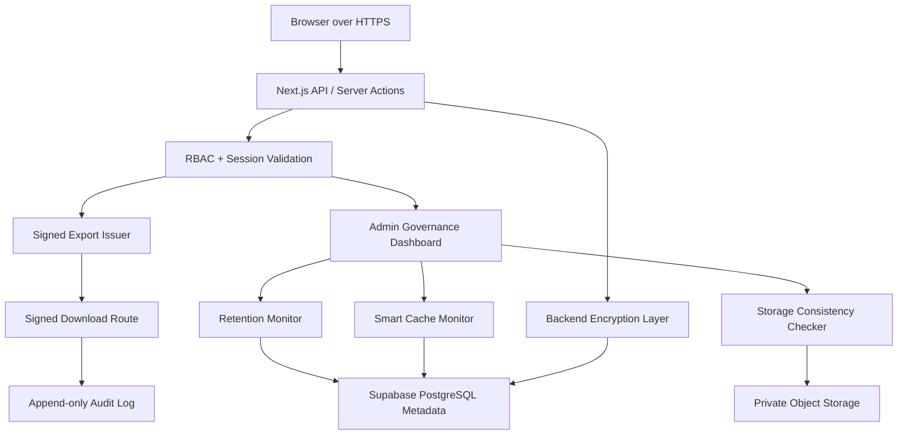

# Production QA and Security Readiness

## QA Checklist

- Incident reporting: create clinical and general incidents, verify NRLS mapping, validation, notifications, and audit entries.
- Dashboard: verify RM, Unit, Executive, and Admin dashboards load with correct role scope and acceptable response time.
- RCA workflow: require RCA, save draft, submit, approve, request revision, create CAPA/action plans, verify actions, close incident.
- Heatmap: verify unit/severity matrix, filters, and no cross-unit exposure for Unit Manager.
- Search/filter: verify date, unit, status, severity, risk code, sentinel, and keyword filters.
- Analytics: verify trends, top units, top risk codes, safety goals, and closed/open logic.
- Export: verify signed URL issue and download, 15-60 minute expiry, role checks, audit logs, and no public direct object URLs.
- Signed URL: test expired, tampered, different-user, and insufficient-role tokens.
- RLS: apply Supabase RLS script in staging and confirm anon/authenticated cannot write app tables.
- Encryption: confirm HN/AN/RCA/reporter encrypted fields are populated and frontend APIs do not expose encrypted payloads.
- Restore: archive/soft-delete an incident, restore as Admin, and verify RCA/action/comment/audit linkages remain intact.
- Archive: verify archived records remain analytics-compatible unless soft-deleted.
- Cleanup scheduler: run `retention-cleanup` in dry-run, verify no data deleted, then verify failsafe with a low max threshold.
- Governance dashboard: verify Admin-only access and denial for RMTeam, UnitManager, Reporter, and Executive.

## Security Testing

- SQL injection: test text filters and export filters with quotes, wildcards, and SQL fragments; Prisma parameterization should prevent injection.
- Privilege escalation: attempt Admin-only governance and audit export as non-Admin.
- IDOR: attempt direct incident, restore, sensitive reveal, and signed export URLs for another unit/user.
- Broken RLS: connect as anon/authenticated in Supabase and confirm no table writes or public attachment access.
- Public bucket exposure: confirm private bucket and no public object URLs.
- Leaked secrets: scan environment and repo for service role keys, `ENCRYPTION_KEY`, `AUTH_SECRET`, and database credentials.
- Unauthorized decrypt access: verify HN/AN reveal requires authenticated user, reason, PDPA confirmation, and audit logging.
- Cross-unit exposure: verify Unit Manager sees only own unit in incident list, dashboard, RCA, action, and export.

## Security Audit Summary

- Governance dashboard is Admin-only at page, middleware/RBAC, and API layers.
- Exports are issued through signed URLs with bounded TTL and revalidated user/role on download.
- Retention is dry-run by default, protected-incident aware, and guarded by max-delete failsafe.
- Cleanup and restore actions are audit logged.
- Storage consistency checks are metadata-only and do not mutate files.
- Sensitive fields remain encrypted through the backend encryption layer and are not emitted by normal incident APIs.

## Rollback Strategy

1. Disable retention execution by setting `RETENTION_DRY_RUN=true`.
2. Remove `retention-cleanup` from any external scheduler.
3. Keep lifecycle columns in place; they are additive and do not affect active records when `deleted_at` is null.
4. If signed export issues occur, keep export routes available but temporarily reduce access to Admin while investigating.
5. Restore mistakenly archived or soft-deleted records with `POST /api/incidents/{id}/restore`.
6. Revert only the governance/signed-export commits if needed; do not roll back unrelated workflow or dashboard changes.

## Architecture Diagram

## Deployment Readiness

- Set `EXPORT_SIGNED_URL_TTL_SECONDS` between `900` and `3600`.
- Keep `RETENTION_DRY_RUN=true` for first production run.
- Set a conservative `MAX_RETENTION_DELETE_PER_RUN`.
- Apply Prisma migrations and regenerate Prisma Client.
- Apply Supabase RLS/storage policy script in staging before production.
- Confirm governance dashboard is visible only to Admin.
- Run the QA checklist and save results with deployment evidence.
